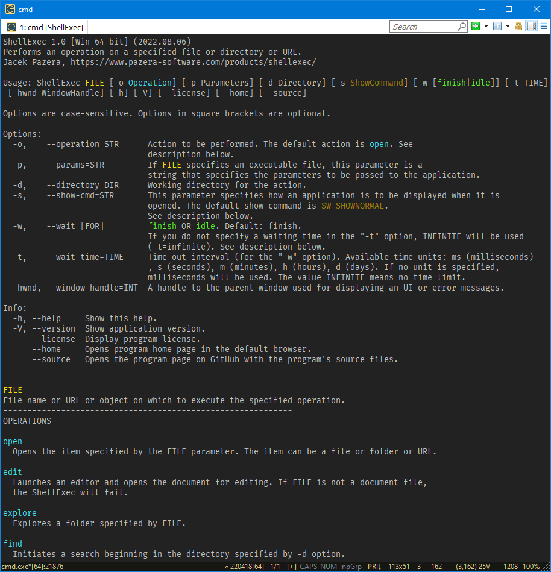

# ShellExec

## Overview

ShellExec is a console application that allows you to run programs (as a current user or administrator), open documents in associated applications, view web pages in your default browser, and more.
It's a "console wrapper" for the [ShellExecuteEx](https://docs.microsoft.com/en-us/windows/win32/api/shellapi/nf-shellapi-shellexecutew) function.



## Download

Compiled binaries:

[ShellExec_win64.zip](https://www.pazera-software.com/files/ShellExec_win64.zip) (~96 KB)  
[ShellExec_win32.zip](https://www.pazera-software.com/files/ShellExec_win32.zip) (~72 KB)

## Usage

```
ShellExec FILE [-o Operation] [-p Parameters] [-d Directory] [-s ShowCommand]   
[-w [finish|idle]] [-t TIME] [-hwnd WindowHandle] [-h] [-V] [--license] [--home] [--source]
```

## Options

Options are case-sensitive. Options in square brackets are optional.

### Main options

`-o`, `--operation=STR`  
Action to be performed. The default action is **open**. See description below.

`-p`, `--params=STR`  
If **FILE** specifies an executable file, this parameter is a string that specifies the parameters to be passed to the application.

`-d`, `--directory=DIR`  
Working directory for the action.

`-s`, `--show-cmd=STR`  
This parameter specifies how an application is to be displayed when it is opened. The default show command is **SW_SHOWNORMAL**. See description below.

`-w`, `--wait=[FOR]`  
**finish** or **idle**. Default: **finish**. If you do not specify a waiting time in the `-t` option, **INFINITE** will be used (`-t=infinite`). See description below.

`-t`, `--wait-time=TIME`  
Time-out interval (for the `-w` option). Available time units: `ms` (milliseconds), `s` (seconds), `m` (minutes), `h` (hours), `d` (days). If no unit is specified, milliseconds will be used. The value **INFINITE** means no time limit.

`-hwnd`, `--window-handle=INT`  
A handle to the parent window used for displaying an UI or error messages.


### Info

`-h`, `--help`  
Show help.

`-V`, `--version`  
Show application version.

`--license`  
Display program license.

`--home`  
Opens program home page in the default browser.

`--source`  
Opens the program page on GitHub with the program's source files.


## FILE
File name or directory or URL or object on which to execute the specified operation.

## Operations

**open**  
Opens the item specified by the FILE parameter. The item can be a file or folder or URL.

**edit**  
Launches an editor and opens the document for editing. If FILE is not a document file, the ShellExec will fail.

**explore**  
Explores a folder specified by FILE.

**find**  
Initiates a search beginning in the directory specified by `-d` option.

**print**  
Prints the file specified by FILE. If FILE is not a document file, the program fails.

**runas**  
Launches an application as Administrator. User Account Control (UAC) will prompt the user for consent to run the application elevated or enter the credentials of an administrator account used to run the application.

**properties**  
Displays the file or folder's properties.

More information (lpOperation): <https://docs.microsoft.com/en-us/windows/win32/api/shellapi/nf-shellapi-shellexecutew>  
More information (lpVerb): <https://docs.microsoft.com/en-us/windows/win32/api/shellapi/ns-shellapi-shellexecuteinfow>

## Show commands

`0` | `SW_HIDE` | `Hide`  
Hides the window and activates another window.

`1` | `SW_SHOWNORMAL` | `ShowNormal` | `SW_NORMAL` | `Normal`  
Activates and displays a window. If the window is minimized or maximized, the system restores it to its original size and position. An application should specify this flag when displaying the window for the first time.

`2` | `SW_SHOWMINIMIZED` | `ShowMinimized` | `Minimized`  
Activates the window and displays it as a minimized window.

`3` | `SW_SHOWMAXIMIZED` | `ShowMaximized` | `Maximized` | `Maximize`  
Activates the window and displays it as a maximized window.

`4` | `SW_SHOWNOACTIVATE` | `ShowNoActivate` | `NoActivate`  
Displays a window in its most recent size and position. This value is similar to SW_SHOWNORMAL, except that the window is not activated.

`5` | `SW_SHOW` | `Show`  
Activates the window and displays it in its current size and position.

`6` | `SW_MINIMIZE` | `Minimize`  
Minimizes the specified window and activates the next top-level window in the Z order.

`7` | `SW_SHOWMINNOACTIVE` | `ShowMinNoActive` | `MinNoActive`  
Displays the window as a minimized window. This value is similar to SW_SHOWMINIMIZED, except the window is not activated.

`8` | `SW_SHOWNA` | `ShowNA`  
Displays the window in its current size and position. This value is similar to SW_SHOW, except that the window is not activated.

`9` | `SW_RESTORE` | `Restore`  
Activates and displays the window. If the window is minimized or maximized, the system restores it to its original size and position. An application should specify this flag when restoring a minimized window.

`10` | `SW_SHOWDEFAULT` | `ShowDefault`  
Sets the show state based on the SW_ value specified in the STARTUPINFO structure passed to the CreateProcess function by the program that started the application.

`11` | `SW_FORCEMINIMIZE` | `ForceMinimize`  
Minimizes a window, even if the thread that owns the window is not responding. This flag should only be used when minimizing windows from a different thread.

More information: <https://docs.microsoft.com/en-us/windows/win32/api/winuser/nf-winuser-showwindow#parameters>

## Wait for

**finish**  
Wait until the running program (specified in the FILE parameter) finishes its operation, or until the time-out interval (`-t` option) has elapsed.

**idle**  
Waits until the specified program has finished processing its initial input and is waiting for user input with no input pending, or until the time-out interval (`-t` option) has elapsed.

More information:  
https://docs.microsoft.com/en-us/windows/win32/api/synchapi/nf-synchapi-waitforsingleobject  
https://docs.microsoft.com/en-us/windows/win32/api/winuser/nf-winuser-waitforinputidle

## Exit codes

0 - Success  
Any other value - Error

## Examples

1. Starts the system calculator:  
    `ShellExec calc`

1. Opens the "hosts" file in the system text editor, Notepad:  
    `ShellExec notepad -o runas -p "C:\Windows\System32\drivers\etc\hosts"`

1. Displays the given website in the default browser:  
    `ShellExec https://example.com`

1. Opens the "win.ini" file in the text editor associated with the INI files:  
    `ShellExec "C:\Windows\win.ini"`

1. Opens the JPG file in the default graphic viewer:  
    `ShellExec "D:\pictures\my picture.jpg"`

1. Opens the BAT file for editing in the default editor and waits for the program to finish:  
    `ShellExec "D:\batch_files\test.bat" -o edit -w=finish`

## License

Public domain.

## Compilation

You need [Embarcadero Delphi](https://www.embarcadero.com/products/delphi) XE2 or newer (the free [Community](https://www.embarcadero.com/products/delphi/starter/free-download) version is eough).

You also need a few units from the [JPLib](https://github.com/jackdp/JPLib) library.
